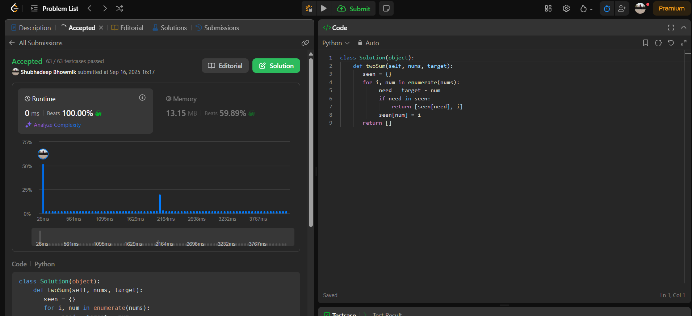
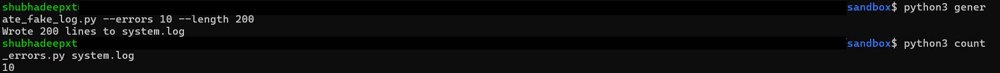

# Day 01 — Two Sum (HashMap) + DevOps Log Script

## 🧩 Problem Practiced: Two Sum (HashMap)
- Learned the **Complement HashMap pattern**.
- Time complexity: O(n), Space: O(n).
- Key idea: store each number in a dict, check if `target - num` is already seen.

---
## What I practiced
- **DSA:** Two Sum using **Complement HashMap** (value→index), single pass O(n)
- **DevOps Script:** Count occurrences of "ERROR" in a log file using Python I/O

## Why HashMap here?
Two Sum asks for indices of two numbers that sum to target. A HashMap lets us answer:
“Have we already seen the number that complements the current one?” in O(1) average time.

**Template**
- `need = target - x`
- If `need` in `seen`: answer
- Else `seen[x] = i`

**Complexity:** Time O(n), Space O(n)

## Dry Run (quick)
Nums=[2,7,11,15], target=9  
- i=0,x=2 → need=7 (not seen) → store {2:0}  
- i=1,x=7 → need=2 (seen at 0) → return [0,1]

## LeetCode
- Problem: https://leetcode.com/problems/two-sum/submissions/1772626698/
- **LeetCode Submission:**  
  

---

## Sandbox — DevOps mini-script
- Safe, self-contained. No system logs touched.

## 🛠️ DevOps Mini-Script: Count "ERROR" in Logs

We don’t use system logs (safe). Instead:
- Generate a fake log file with random INFO/WARN/ERROR lines.
- Count how many times "ERROR" appears.

### ▶️ How to Run

From this folder:

```bash
cd sandbox

# Step 1: Generate fake log (200 lines, ~10 errors)
python3 generate_fake_log.py --errors 10 --length 200

# Step 2: Count errors
python3 count_errors.py system.log
```

- **Log Generator and Error Count Run:**
  
